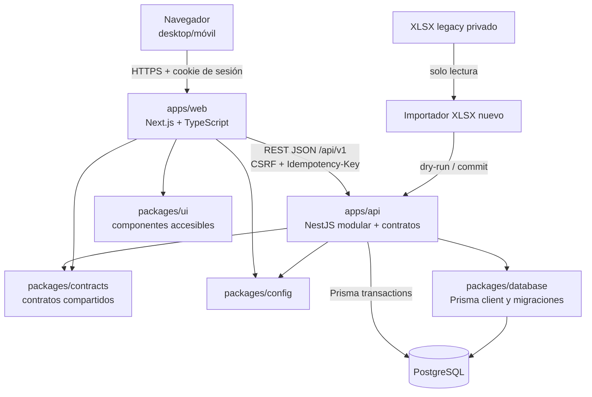

# Diagrama de contenedores

## Contenedores lógicos

## Responsabilidades

| Contenedor/paquete | Responsabilidad | No debe hacer |
|---|---|---|
| `apps/web` | Rutas, vistas, formularios, tablas, queries, estados UI y accesibilidad | Autorizar por sí solo, calcular stock definitivo o acceder a DB |
| `apps/api` | Autenticación, autorización, servicios de aplicación, transacciones, contratos y errores | Incrustar reglas en controladores o confiar en cálculos cliente |
| `packages/database` | Prisma, migraciones, acceso transaccional y utilidades Decimal | Ejecutar importación en una migración de esquema |
| `packages/contracts` | DTO/esquemas compartidos y tipos públicos | Exponer modelos internos, hashes o secretos |
| `packages/ui` | Componentes visuales reutilizables y accesibles | Contener catálogos o reglas de negocio hard-coded |
| `packages/config` | Configuración tipada por ambiente | Contener secretos versionados |
| PostgreSQL | Estado operacional, constraints, transacciones y auditoría | Aceptar balances duplicados o movimientos históricos editados |
| Importador | Perfilado, staging, mapeos, reportes y reconciliación | Corregir datos silenciosamente o modificar el XLSX |

## Flujo de una mutación

1. La UI valida formato y evita doble envío.
2. La API autentica sesión, valida CSRF, permiso, payload e idempotencia.
3. El servicio abre una transacción PostgreSQL.
4. Bloquea balances en orden determinista, revalida reglas y escribe documento, balance, movimientos y auditoría.
5. Confirma transacción y guarda respuesta idempotente.
6. La UI invalida queries afectadas y muestra el estado resultante.

## Separación de ambientes

Desarrollo usa Docker Compose. CI usa servicios efímeros. Staging y producción tendrán web, API y PostgreSQL independientes; no comparten base de datos, cookies, secretos ni dominio de sesión.

Swagger/OpenAPI HTTP no está montado en FASE 3B. La arquitectura conserva
OpenAPI como objetivo, pero solo podrá exponerse detrás de una puerta
autenticada aprobada.
