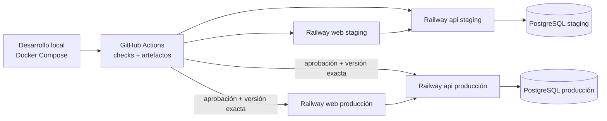

# Topología de despliegue

> **Excepción de staging vigente:** el piloto gratuito para cuatro usuarios usa
> Render Free + Neon Free conforme a
> [ADR-013](../decisions/ADR-013-free-staging-pilot.md) y al
> [runbook operativo](../deployment/render-neon-staging-pilot.md). Esta excepción
> no sustituye la topología de producción descrita abajo.

## Ambientes

## Desarrollo

Docker Compose levantará PostgreSQL y las dependencias estrictamente necesarias. Web/API podrán ejecutarse localmente con variables de ejemplo. Los datos privados no se incorporan a imágenes, seeds ni volúmenes versionados.

## CI

GitHub Actions ejecutará instalación reproducible, lint, typecheck, pruebas, integración PostgreSQL, build y análisis de migraciones. La rama protegida no despliega si falla una puerta. Los artefactos se construyen desde el commit aprobado.

## Staging

- servicios `sgi-web-staging`, `sgi-api-staging` y PostgreSQL staging;
- secretos, cookies, dominios, almacenamiento y base separados de producción;
- inicialmente sin datos reales; rehearsal usa copia controlada;
- migraciones con `prisma migrate deploy` como paso previo verificable;
- health/readiness independientes;
- E2E, reconciliación, backup y restauración antes de promoción.

## Producción

- web, API y PostgreSQL separados de staging;
- HTTPS obligatorio, cookies Secure y CORS al origen exacto;
- PostgreSQL no público salvo intervención temporal aprobada;
- despliegue de la misma versión probada en staging;
- migración de esquema antes de habilitar tráfico, nunca importación automática;
- smoke tests y observación posterior al deploy.

## Dominio y presupuesto

No existe dominio seleccionado. Staging/producción usarán los dominios de plataforma configurados hasta una decisión. El presupuesto objetivo inicial es USD 15/mes; FASE 12 deberá validar el costo de web, API y PostgreSQL, y documentar cualquier excepción antes de ampliar recursos.

## Datos, backup y rollback

La topología debe permitir backup programado, restauración documentada, ensayo de restauración y rollback de aplicación/esquema/datos. RPO, RTO, frecuencia, retención y caída máxima siguen `REQUIRES_HUMAN_APPROVAL`; no se fijan valores ficticios.

## Observabilidad mínima

- logs JSON correlacionados de web/API;
- request ID, actor ID y código de error sin secretos;
- health/readiness, reinicio controlado y graceful shutdown;
- alertas básicas de disponibilidad y errores según capacidades/costo de Railway;
- guía de diagnóstico y registro de despliegues.

## Cutover y legacy

Durante el corte se congelan escrituras legacy, se exporta el XLSX final, se calcula checksum, se ejecutan dry-run/commit/reconciliación y smoke tests. Google Sheets permanece solo lectura hasta completar migración, reconciliación, aprobación de producción y estabilización. La duración exacta permanece abierta.
