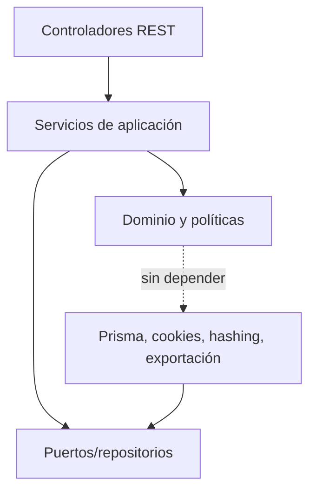
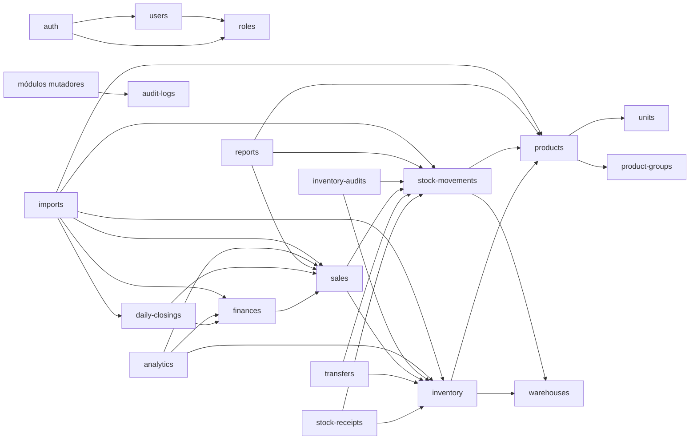

# Mapa de dependencias de módulos

## Capas

El dominio no importa NestJS, Prisma, Next.js ni tipos HTTP. Los adaptadores implementan puertos definidos por los módulos.

## Dependencias principales

## Reglas anti-ciclo

1. Catálogos no dependen de módulos operacionales.
2. `inventory` no depende de ventas, entradas o transferencias; recibe comandos con una referencia de origen.
3. `stock-movements` no modifica balances y no llama al origen.
4. `sales` puede leer productos y aplicar inventario, pero Finanzas consume ventas como lectura derivada; ventas no depende de Finanzas.
5. `reports`/`analytics` dependen de contratos de lectura, nunca de servicios mutadores.
6. `imports` es un orquestador offline/CLI; los módulos no dependen de él.
7. `audit-logs` es una dependencia terminal.

## Contratos entre módulos

Los módulos se comunican dentro del proceso mediante comandos/puertos tipados, por ejemplo:

- `InventoryPort.lockBalances(keys)`;
- `InventoryPort.applyDelta(source, productId, warehouseId, quantity)`;
- `StockMovementPort.append(movement)`;
- `SalesReadPort.completedSalesForDate(localDate)`;
- `AuditLogPort.append(entry)`.

No se introducen RPC internas, eventos asíncronos ni colas. Si un flujo requiere varias escrituras, comparte el cliente de transacción Prisma proporcionado por el coordinador.
