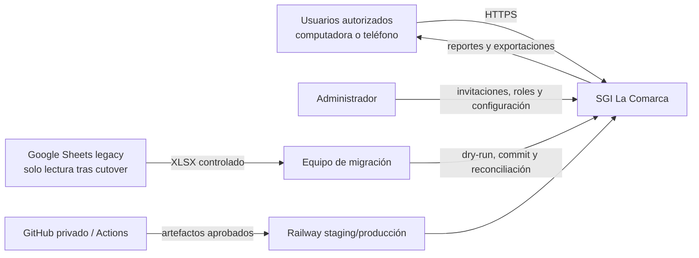

# Contexto del sistema futuro

## Propósito

SGI La Comarca será el sistema operacional para productos, inventario, ventas, finanzas, cierres, auditoría, reportes y migración. Sustituirá las escrituras de Google Sheets después del cutover, manteniendo el legacy en modo solo lectura durante estabilización.

## Actores

| Actor | Interacción |
|---|---|
| Dylan | Inventario, Finanzas, cierres y cancelación de ventas; ventas solo si se le asigna SALES |
| Samantha | Inventario, ventas autorizadas, Finanzas y cierres |
| Jean | Inventario y demás permisos asignados; sin Finanzas inicialmente |
| Luden | Inventario y demás permisos asignados; sin Finanzas inicialmente |
| Administrador | Invita usuarios, asigna roles, revoca sesiones y configura catálogos |
| Equipo de migración | Ejecuta perfilado, dry-run, importación, reconciliación y rollback |
| GitHub Actions | Valida y despliega versiones aprobadas |
| Railway | Ejecuta web, API y PostgreSQL separados por ambiente |

## Sistemas externos

- Navegadores de escritorio y móvil.
- Google Sheets/Apps Script legacy: fuente de migración y consulta solo lectura tras el corte.
- GitHub privado: código, documentación, CI y mapeos aprobados sin datos privados.
- Railway: staging, producción y PostgreSQL.
- No se integran CRM, WhatsApp, Meta Ads, catálogo público ni servicios offline en V1.

## Frontera y responsabilidades

Dentro de SGI quedan UI, API, reglas de aplicación, autorización, persistencia, auditoría, importación y reporting. PostgreSQL es la única frontera transaccional operacional. El navegador nunca decide permisos, stock, precio final ni totales definitivos.

Google Sheets no será consultado por operaciones normales después del corte. No se elimina hasta completar reconciliación, aprobación de producción y el periodo de estabilización pendiente.

## Restricciones

- Monolito modular; no microservicios, Redis, colas, Kubernetes ni GraphQL.
- REST + OpenAPI.
- Sesiones opacas revocables.
- Dinero NIO con `NUMERIC`/`Decimal`; presentación C$.
- UTC en persistencia y `America/Managua` en presentación.
- Conectividad obligatoria en V1, sin impedir evaluar offline posteriormente.
- Objetivo inicial de Railway: máximo USD 15/mes, sujeto a validación en FASE 12.
- Dominio, RPO, RTO y retención exacta del legacy permanecen abiertos.

## Objetivos de calidad

- consistencia atómica de stock/ventas;
- idempotencia persistente;
- autorización backend denegada por defecto;
- trazabilidad de datos y actores;
- reconciliación sin pérdida silenciosa;
- responsive, accesible y usable por teclado;
- despliegue y rollback reproducibles.

## Garantía de reglas obligatorias

| # | Regla | Mecanismo arquitectónico |
|---:|---|---|
| 1 | Todo cambio de inventario crea movimiento inmutable | `stock_movements` append-only y escritura en la transacción del documento |
| 2 | No existe stock negativo | balance bloqueado, validación Decimal y check `quantity >= 0` |
| 3 | Un balance por producto–almacén | constraint único en `inventory_balances` |
| 4 | Entrada, balance y movimiento juntos | transacción coordinada por `stock-receipts` |
| 5 | Transferencia atómica | bloqueo de ambos balances, salida/entrada y dos movimientos en una transacción |
| 6 | Venta, items, movimientos y descuento juntos | transacción coordinada por `sales` después de validar todos los items |
| 7 | Venta multi-almacén | `warehouse_id` obligatorio en cada `sale_item` |
| 8 | Confirmar tránsito no descuenta nuevamente | transición bloqueada de venta sin acceso a balances ni movimientos |
| 9 | Cancelación repone exactamente una vez | lock de venta, estado elegible, balances originales, transacción e idempotencia |
| 10 | Crear, confirmar y cancelar son idempotentes | `idempotency_records` + estado/response persistidos |
| 11 | Dinero exacto | PostgreSQL `NUMERIC`, Prisma `Decimal`, strings decimales en API |
| 12 | Cantidades decimales | columna `NUMERIC`/Decimal y validaciones sin enteros forzados |
| 13 | UTC/Managua | instantes UTC y fechas/días presentados en `America/Managua` |
| 14 | Productos con historial no se borran | `active`/desactivación y foreign keys restrictivas |
| 15 | Mutaciones importantes auditadas | `audit_logs` dentro de la misma transacción |
| 16 | Ninguna ruta operacional anónima | guard de sesión global; allowlist solo para login/activación/health |
| 17 | Permisos backend | guards y políticas de recurso en servicios |
| 18 | Trazabilidad legacy | `legacy_id`, `legacy_row_number`, `import_batch_id`, `raw_data` |
| 19 | Inventario como saldo inicial | mapeo/importador usa Inventario para cantidad, precio y costo iniciales |
| 20 | Movimientos como historial | importación append-only con `legacy_resulting_stock` informativo |
| 21 | Sin duplicar ingresos de ventas | ventas completadas como proyección; filas automáticas solo evidencia |
| 22 | Funcionalidad frontend con destino | matriz 46/46 y agrupación explícita de 138 funciones frontend |
| 23 | CSV legacy y XLSX nuevo separados | procesos, comandos, riesgos y endpoints/disposición distintos |
