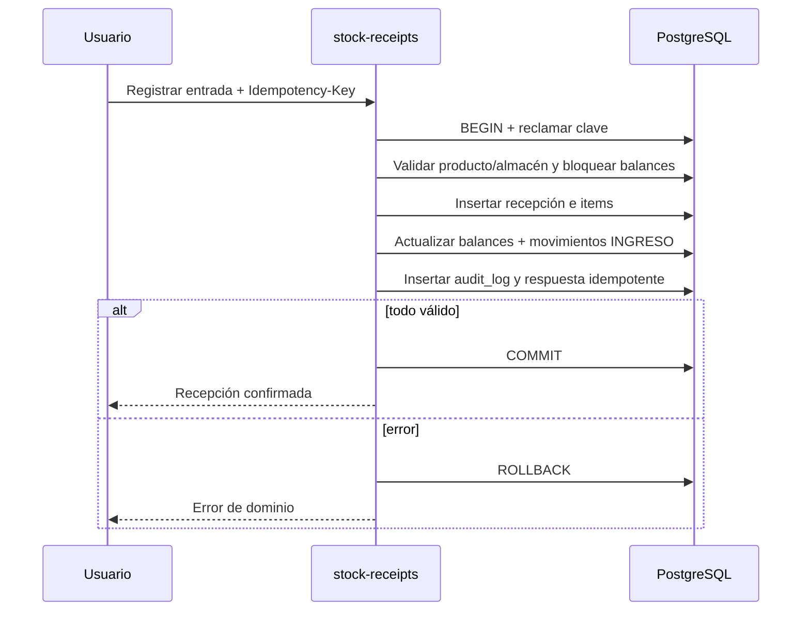
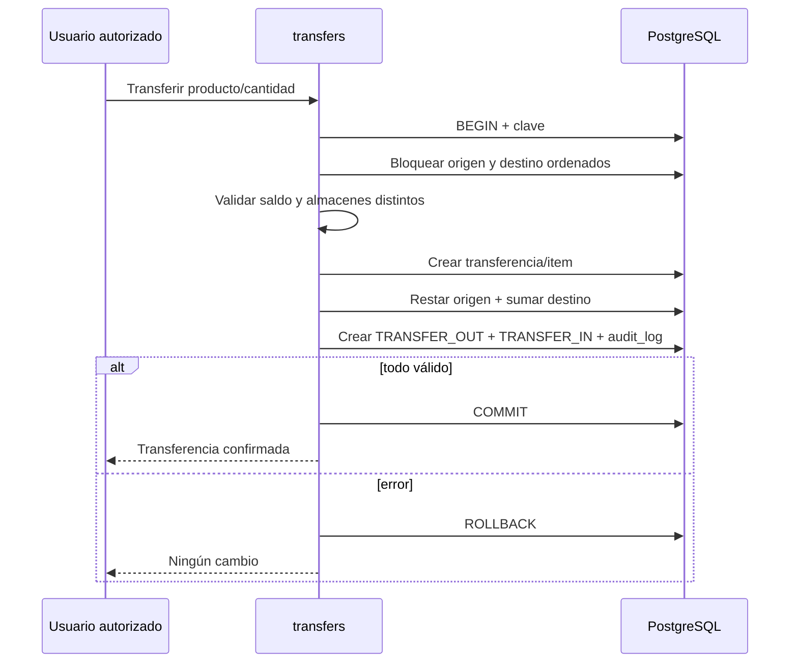
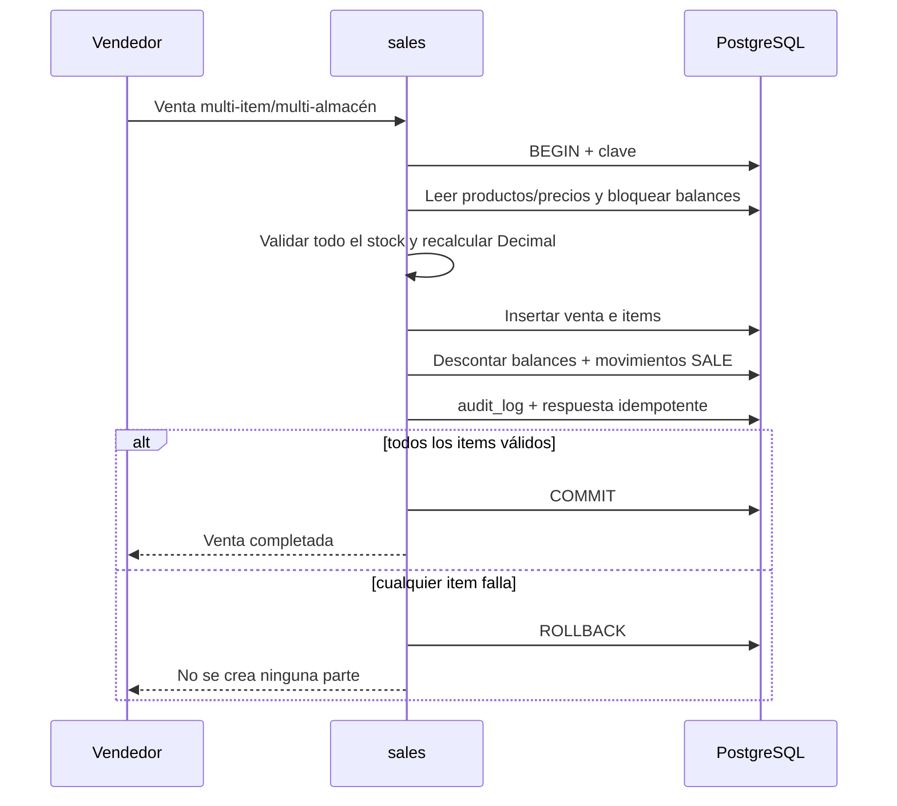
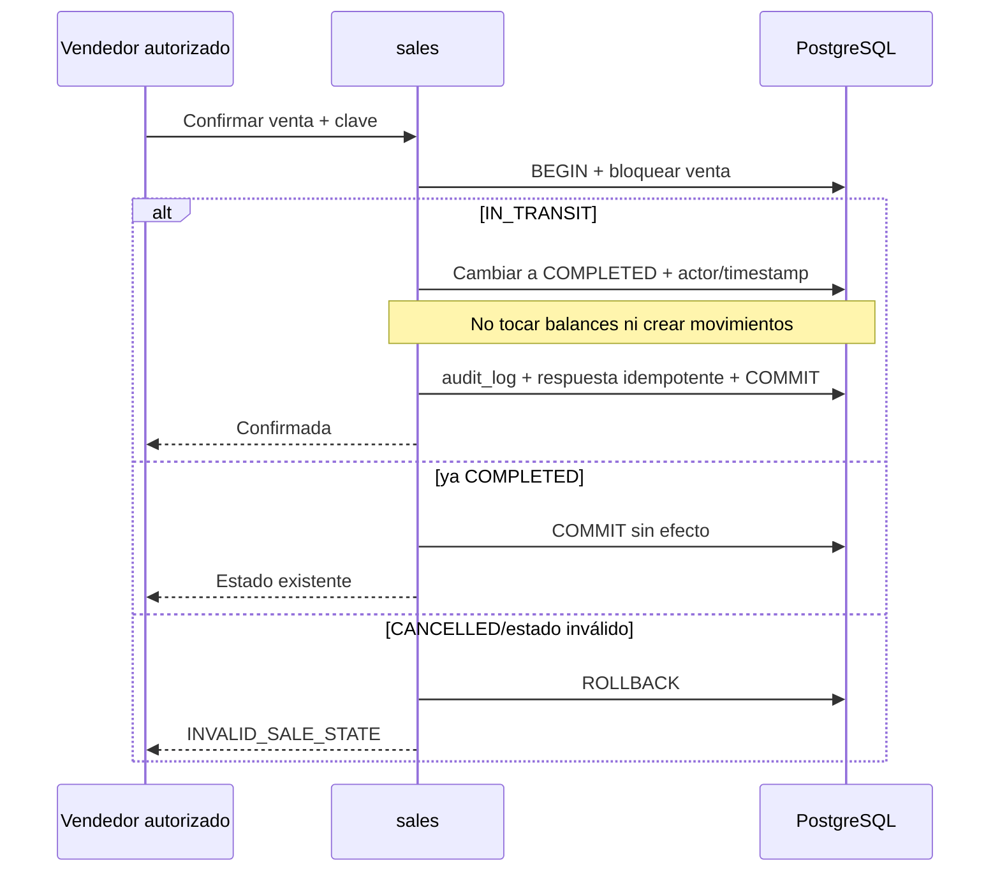
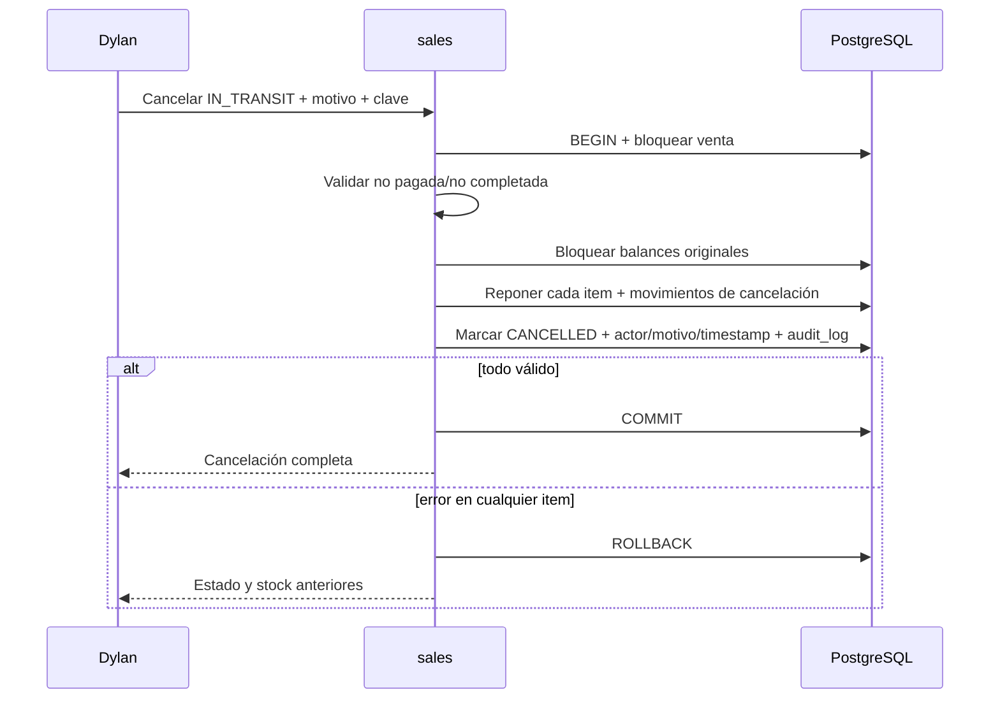
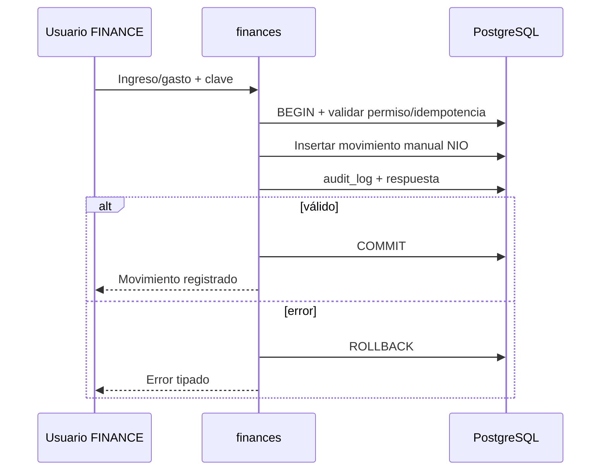
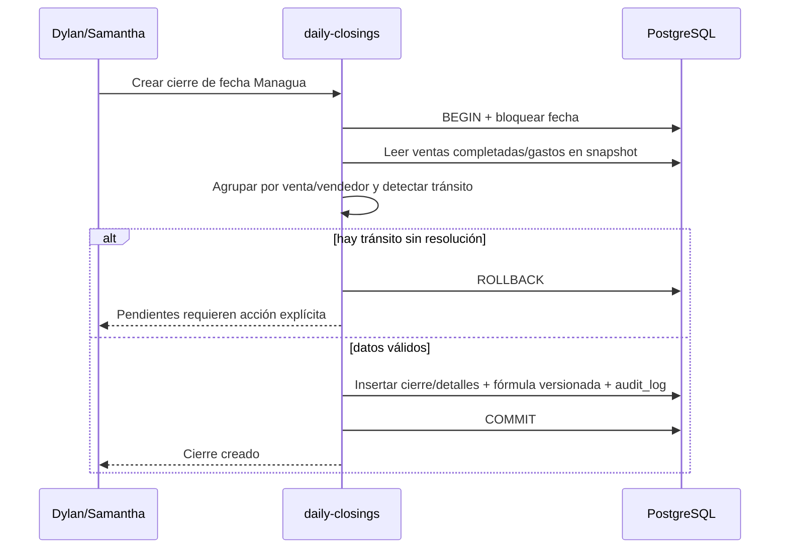
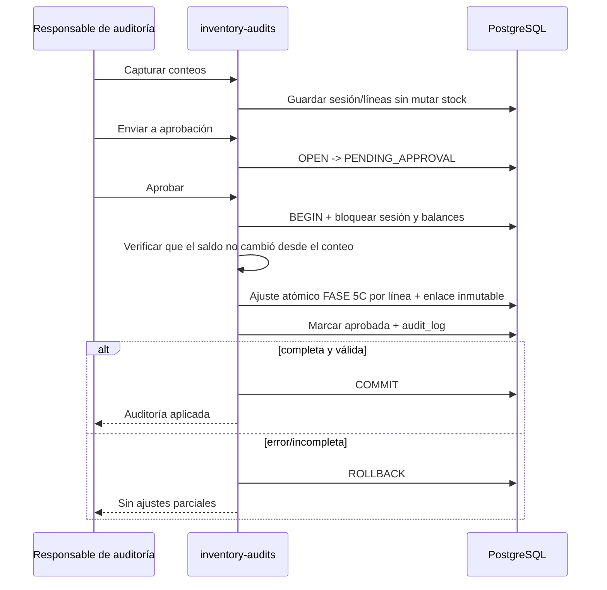

# Diseño transaccional

## Convenciones comunes

- Todas las cantidades son `Decimal`; `quantity_delta` usa signo: positivo suma, negativo resta.
- Dinero usa `Decimal` NIO; el API recibe/devuelve strings decimales.
- Cada comando crítico incluye `actor_id` y un payload validado. Cuando la
  infraestructura de idempotencia sea aprobada para el módulo, también incluirá
  `idempotency_key`.
- La persistencia de idempotencia es específica de cada operación aprobada. El
  fundamento de transferencias de FASE 6A conserva en `inventory_transfers` el
  hash de la clave y el hash canónico de la solicitud, con scope por actor. Los
  demás módulos no obtienen idempotencia implícita por este cambio.
- Los balances se bloquean con `SELECT ... FOR UPDATE` en orden estable `(product_id, warehouse_id)` para reducir deadlocks.
- El constraint único `(product_id, warehouse_id)` y una comprobación dentro de la transacción impiden saldo negativo.
- Documento, balances, movimientos y audit log se escriben en la misma transacción.
- Cualquier error revierte todo. Solo se reintentan conflictos transitorios cuando la idempotencia lo hace seguro.

El siguiente flujo es la convención objetivo para comandos que ya dispongan de
persistencia idempotente, no una afirmación de que todos los módulos actuales la
implementen:

```text
execute(command):
  authenticate actor
  authorize operation and resource policy
  validate DTO, CSRF and Idempotency-Key
  begin transaction
    claim or load idempotency record
    if completed: return stored response
    if same key has different payload: raise IDEMPOTENCY_KEY_REUSED
    execute domain flow
    append audit log
    persist idempotent response
  commit
  on any error: rollback and map typed domain error
```

## 1. Entrada de productos

```text
begin
claim idempotency("stock-receipt:create")
validate receipt, at least one item, positive quantity and allowed warehouse
resolve active product; create product only when the command explicitly contains approved product data
lock every product–warehouse balance in deterministic order
create stock_receipt and stock_receipt_items
for each item:
  read old balance (create zero balance safely if absent)
  write new balance = old + quantity
  append stock_movement(RECEIPT, +quantity, receipt_item_id)
append audit_log with receipt and balance changes
complete idempotency record
commit
```

Errores: `VALIDATION_FAILED`, `DUPLICATE_PRODUCT_CODE`, almacén/producto inactivo, clave reutilizada o conflicto concurrente. Un fallo revierte producto nuevo, recepción, balance y movimiento.



## 2. Ajuste positivo o negativo — implementado en FASE 5C

```text
begin
require permission inventory.adjust, reason and non-zero signed delta
require active actor, active product and active warehouse
lock target balance with SELECT ... FOR UPDATE
read previous_quantity
calculate new_quantity = previous_quantity + delta
if new_quantity < 0: raise INVENTORY_NEGATIVE_BALANCE
append inventory_movement(ADJUSTMENT, previous, delta, new, reason, actor)
update inventory_balance and increment version
append audit_log with previous/new quantity
commit
```

La API recibe el delta firmado como string decimal. El motivo, actor y timestamp
son obligatorios. Un error revierte movimiento, saldo y auditoría. Dos ajustes
concurrentes del mismo producto–almacén se serializan sobre el lock de la fila y
no pierden actualizaciones. No hay reintentos automáticos.

El esquema no contiene todavía registros de idempotencia. FASE 5C bloquea el
doble submit en UI, pero repetir deliberadamente una solicitud ya confirmada
crearía otro ajuste. La idempotencia persistente queda como cambio separado de
esquema y contrato; no se simula con memoria ni con una cabecera ignorada.

```mermaid
sequenceDiagram
    participant U as Responsable
    participant I as inventory
    participant DB as PostgreSQL
    U->>I: Delta firmado y motivo
    I->>DB: BEGIN + autorización efectiva
    I->>DB: Bloquear balance y leer cantidad anterior
    I->>I: Calcular nueva; validar >= 0
    I->>DB: Insertar movimiento firmado
    I->>DB: Actualizar balance + audit_log
    alt válido
        I->>DB: COMMIT
        I-->>U: Anterior/nueva confirmadas
    else insuficiente u otro error
        I->>DB: ROLLBACK
        I-->>U: Error tipado
    end
```

## 3. Transferencia — implementada en FASE 6B

FASE 6A incorporó `inventory_transfers`, `inventory_transfer_items` y
`inventory_movements.transfer_item_id`. FASE 6B expone el comando y el historial.
`transfers.create` se concede exclusivamente a `INVENTORY_MANAGER`; sesión
activa, permiso efectivo y precedencia de DENY son obligatorios.

```text
begin
require transfers.create
validate origin != destination and quantity > 0
begin READ COMMITTED
take transaction-scoped advisory lock for actor + idempotency key hash
load existing transfer; return it only when request hash matches
lock product and both warehouses in stable order
create destination zero balance with ON CONFLICT DO NOTHING when absent
lock every balance of the product ordered by warehouse id
if origin.quantity < quantity: raise INSUFFICIENT_STOCK
create inventory_transfer and item
decrease origin; increase destination
append stock_movement(TRANSFER_OUT, -quantity, origin, transfer_item_id)
append stock_movement(TRANSFER_IN, +quantity, destination, transfer_item_id)
append exactly one inventory.transferred audit_log
validate consolidated stock is unchanged
commit
```

La pareja de movimientos comparte `transfer_item_id` y nunca existe uno sin el
otro. PostgreSQL limita cada ítem a un `TRANSFER_OUT` y un `TRANSFER_IN`; un
constraint trigger diferido comprueba al commit que existen exactamente ambos y
que producto, almacenes, magnitud y actor coinciden con el documento. Las tablas
de documento e ítems reutilizan la protección append-only del ledger. Un fallo
en destino revierte también la salida.

La idempotencia no persiste la clave original. FASE 6B calcula
`idempotency_key_hash = SHA-256(Idempotency-Key)` y reclamar atómicamente la
unicidad `(actor_user_id, idempotency_key_hash)`. El `request_hash` será SHA-256
UTF-8 del objeto canónico validado, con claves en este orden fijo:
`fromWarehouseId`, `productId`, `quantity`, `reason`, `toWarehouseId`. La
cantidad se expresará como decimal canónico y el motivo conservará el valor ya
validado. No forman parte del hash el actor, la clave original ni timestamps del
servidor. Misma clave y mismo hash devuelve el documento existente; misma clave
y hash distinto produce `409 IDEMPOTENCY_KEY_REUSED`. Un rollback no deja claim
parcial. El advisory lock evita la carrera `SELECT → INSERT` entre dos requests
con la misma intención. Los locks de producto, almacenes y balances tienen orden
estable; no existen retries ilimitados. Conflictos transitorios se devuelven como
`409 INVENTORY_TRANSFER_CONFLICT`.

Si el destino no tiene balance, se crea en cero dentro de la misma transacción y
la entrada informa `before = 0`. La operación no crea, copia ni modifica
valoraciones. Dos movimientos correlacionados, el audit log y ambos balances se
confirman juntos o se revierten juntos.



## 4. Venta completada

```text
begin
claim idempotency("sale:create")
require sales.create; validate seller, channel/payment fields and non-empty items
load active products and authoritative current prices/costs from operational model
group required quantity by product–warehouse
lock all balances in deterministic order
validate every balance before any write
recalculate line subtotals, shipping allocation and total with Decimal
create sale(status=COMPLETED, paid/completed fields) and normalized sale_items
for each grouped requirement:
  decrement original warehouse balance
  append stock_movement(SALE, negative quantity, sale_item_id)
append audit_log; complete idempotency; commit
```

El envío se almacena una vez en el encabezado. Si se requiere asignación contable por línea, sus redondeos deben sumar exactamente el envío del encabezado. Precio y costo quedan como snapshots; el cliente no decide el total.



## 5. Venta en tránsito

```text
begin
claim idempotency("sale:create")
perform the same stock/price/item validations and locks as completed sale
create sale(status=IN_TRANSIT, paid=false) and sale_items with original warehouse
decrement balances now and append SALE movements now
append audit_log; complete idempotency; commit
```

Una venta en tránsito ya consume inventario. No se reconoce como ingreso ni cierre completado hasta confirmación. Un fallo revierte todas las líneas.

```mermaid
sequenceDiagram
    participant U as Vendedor
    participant S as sales
    participant DB as PostgreSQL
    U->>S: Crear venta IN_TRANSIT
    S->>DB: BEGIN + clave
    S->>DB: Bloquear y validar todos los balances
    S->>DB: Insertar venta/items IN_TRANSIT
    S->>DB: Descontar inventario + movimientos SALE
    S->>DB: audit_log
    alt válido
        S->>DB: COMMIT
        S-->>U: Pendiente; inventario ya descontado
    else error
        S->>DB: ROLLBACK
        S-->>U: Sin venta ni descuento
    end
```

## 6. Confirmación de venta en tránsito

```text
begin
claim idempotency("sale:confirm")
require sales.confirm_in_transit
lock sale row
if CANCELLED: raise INVALID_SALE_STATE
if COMPLETED: return existing completed representation without effects
require IN_TRANSIT and unpaid
update status=COMPLETED, confirmed_by=actor, confirmed_at=UTC now
do not read, lock or update inventory balances
do not create stock movements
append audit_log(state transition)
complete idempotency; commit
```

La repetición, incluso con una clave nueva sobre una venta ya completada, no produce efectos adicionales. La decisión de evidencia de pago adicional permanece abierta.



## 7. Cancelación de venta

```text
begin
claim idempotency("sale:cancel")
require sales.cancel (Dylan initially) and non-empty reason
lock sale row
if CANCELLED: return existing cancellation without effects
require status=IN_TRANSIT and paid=false; completed/paid sales are rejected
load sale_items and lock every original product–warehouse balance ordered
for each item:
  increment its original warehouse exactly by item.quantity
  append stock_movement(SALE_CANCELLATION, +quantity, sale_item_id)
update sale=CANCELLED, cancelled_by/at/reason
append audit_log with state and balance changes
complete idempotency; commit
```

No hay cancelación parcial. Devoluciones/reembolsos son procesos distintos y fuera de V1. Constraint/estado y transacción impiden una segunda reposición.



## 8. Movimiento financiero manual

```text
begin
claim idempotency("financial-transaction:create")
require permission finances.manual.create
validate date, type INCOME|EXPENSE, category, responsible user and amount > 0
create financial_transaction(source=MANUAL, amount Decimal, currency=NIO)
append audit_log
complete idempotency; commit
```

Las ventas completadas se consultan como fuente derivada y no crean filas duplicadas en `financial_transactions`. Las filas `Ventas de Sistema` legacy quedan como evidencia de importación excluida del agregado operacional.



## 9. Cierre diario

```text
begin
claim idempotency("daily-closing:create")
require permission closings.create (Dylan or Samantha initially)
derive Managua local date boundaries and lock unique closing date/key
reject if a current closing already exists
read completed sales and manual expenses inside one consistent snapshot
group sales by sale id and seller; capture system totals
validate user-entered actual cash/digital values
if IN_TRANSIT sales exist: report and require explicit resolution; never cancel silently
calculate comparison fields using the approved formula version
create daily_closing and normalized details
append audit_log; complete idempotency; commit
```

La fórmula final de diferencia, tolerancia y tratamiento de gastos permanece abierta. Hasta aprobarse, staging almacena componentes y resultado comparativo legacy claramente versionado; no declara un cierre `BALANCED` mediante una regla inventada. Reapertura es otra mutación idempotente, exige `closings.reopen` (Dylan/Samantha inicialmente), motivo, versión y audit log.



## 10. Auditoría física y ajuste resultante

> Implementado por FASE 9A (esquema) y 9B.1 (aplicación y API). El bloque
> siguiente describe el flujo tal como quedó construido; una versión anterior
> de este documento recalculaba la diferencia contra el saldo vigente al
> aprobar, lo cual es incompatible con el esquema desplegado: el trigger
> diferido `check_inventory_count_line_adjustment` exige que el movimiento
> enlazado tenga `quantity_delta` exactamente igual a la columna `difference`
> fijada al capturar.

```text
capture phase:
  create count session with selected configurable warehouses (scope is explicit)
  per counted item:
    expected = current balance at capture time (0 when no balance row exists)
    difference = counted - expected, stored on the line; no stock mutation
  a line is immutable once captured: correcting a miscount means cancelling

submit phase:
  require at least one line; OPEN -> PENDING_APPROVAL

approval phase begin:
  require inventory.audit.approve and inventory.adjust on the same actor
  lock the session; reject any state other than PENDING_APPROVAL
    (already APPROVED returns the current state: idempotent by effect)
  lock every affected balance in one statement, ordered by (product, warehouse)
  for each line with difference != 0:
    if current balance != the line's stored expected quantity:
      reject the WHOLE approval (INVENTORY_COUNT_BALANCE_CHANGED)
    delegate to the FASE 5C atomic adjustment path with delta = difference
    link the produced movement to the line (its only permitted update)
  mark the session APPROVED with approver/timestamp
  append exactly one audit_log; commit
```

La aprobación nunca escribe stock por su cuenta: delega en la ruta atómica de
FASE 5C, de modo que todo cambio de saldo sigue produciendo un movimiento
inmutable. La diferencia se fija al capturar y jamás se recalcula: si el saldo
cambió entre el conteo y la aprobación, la cantidad contada dejó de ser
verdad física y la sesión completa se rechaza en lugar de aterrizar en un
número distinto.

Un conteo ausente no equivale a cero; queda pendiente y no cambia saldo — se
reporta como `pendingItems` (AT-AUD-02). La captura externa hard-coded legacy
se importa como evidencia, no se ejecuta contra producción.



## Matriz de bloqueos y movimientos

| Flujo | Filas bloqueadas | Movimientos | Idempotencia |
|---|---|---|---|
| Entrada | balances destino | `RECEIPT +` | crear recepción |
| Ajuste | balance objetivo | `ADJUSTMENT +/-` | crear ajuste |
| Transferencia | balances origen/destino | `TRANSFER_OUT -`, `TRANSFER_IN +` | crear transferencia |
| Venta | todos los balances de items | `SALE -` | crear venta |
| Venta en tránsito | todos los balances de items | `SALE -` | crear venta |
| Confirmación | venta | ninguno | confirmar venta |
| Cancelación | venta + balances originales | `SALE_CANCELLATION +` | cancelar venta |
| Finanzas manual | categoría/configuración relevante | ninguno de stock | crear movimiento financiero |
| Cierre | clave de fecha/cierre | ninguno | crear/reabrir cierre |
| Conteo físico: crear | ninguna | ninguno | `Idempotency-Key` por actor |
| Conteo físico: capturar | sesión | ninguno | clave natural (sesión, producto, almacén) |
| Conteo físico: aprobar | sesión + balances de líneas con diferencia | `ADJUSTMENT +/-` (uno por línea con diferencia) | por efecto: estado destino ya alcanzado |
