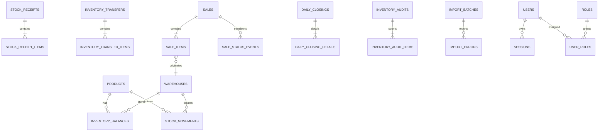

# Entidades PostgreSQL propuestas

## Convenciones

- PK técnicas UUID; identificadores legibles (`sale_number`, `transfer_number`) separados.
- `created_at`/`updated_at` en UTC; fechas de negocio locales se guardan como `date` además del instante cuando corresponda.
- Dinero `NUMERIC` y Prisma `Decimal`; objetivo inicial `NUMERIC(18,2)` sujeto a perfilado final.
- Cantidades `NUMERIC`; objetivo inicial `NUMERIC(18,4)` para admitir decimales.
- `legacy_id`, `legacy_row_number`, `import_batch_id` y `raw_data JSONB` se incluyen en entidades importables cuando corresponda.
- Datos históricos inmutables no tienen `updated_at` operacional ni borrado físico.

## Identidad y seguridad

| Entidad | Campos esenciales | Constraints/índices |
|---|---|---|
| `users` | id, display_name, login identifier, password_hash, status, activated_at, timestamps | identidad normalizada única; hash nunca se expone |
| `roles` | id, code, name | `code` único; códigos iniciales aprobados |
| `permissions` | id, code, description | `code` único |
| `role_permissions` | role_id, permission_id | PK compuesta |
| `user_roles` | user_id, role_id, granted_by, granted_at | único por par |
| `user_permissions` | user_id, permission_id, effect, granted_by | soporte excepcional auditado; evitar cuando baste un rol |
| `sessions` | id, user_id, token_hash, created/expires/last_seen/revoked, revoke_reason | token_hash único; índices por usuario/expiración |
| `user_invitations` | id, invited_identity, token_hash, expires/consumed, invited_by | token_hash único, uso único |
| `idempotency_records` | actor_id, operation, key, request_hash, status, response, resource_id, timestamps | único `(actor_id, operation, key)` |

## Catálogos

| Entidad | Campos esenciales | Constraints/índices |
|---|---|---|
| `units` | id, code, name, active, legacy fields | code/nombre normalizado único tras mapeo aprobado |
| `product_groups` | id, code, name, active, legacy fields | code único |
| `warehouses` | id, code, name, active, legacy fields | code único; no hard-coded |
| `sales_channels` | id, code, name, active, legacy fields | variantes permanecen hasta mapeo aprobado |
| `financial_categories` | id, type, code, name, active | único por tipo/código |
| `system_settings` | key, value_json, updated_by, updated_at | key única; no secretos |

## Productos e inventario

| Entidad | Campos esenciales | Constraints/índices |
|---|---|---|
| `products` | id, code, name, description, unit_id, product_group_id, minimum_stock, current_price, current_cost, currency_code, active, legacy fields | `code` único después de resolución; índice búsqueda/nombre/grupo |
| `inventory_balances` | id, product_id, warehouse_id, quantity, version, price_evidence, cost_evidence, legacy fields | único `(product_id, warehouse_id)`; check quantity >= 0 |
| `stock_movements` | id, product_id, warehouse_id, quantity_delta, type, source_type, source_id, occurred_at, actor_id, observation, legacy_resulting_stock, legacy fields | append-only; índices por producto/almacén/fecha/tipo/source |
| `inventory_adjustments` | id, number, product_id, warehouse_id, previous_quantity, new_quantity, delta, reason, actor_id, occurred_at, idempotency_key | delta coherente; número único |
| `stock_receipts` | id, receipt_number, occurred_at, warehouse_id, actor_id, notes, idempotency_key, legacy fields | número y clave únicos según alcance |
| `stock_receipt_items` | id, receipt_id, product_id, quantity, unit_cost_snapshot, unit_price_snapshot, legacy fields | cantidad > 0; índice receipt/product |
| `inventory_transfers` | id, transfer_number, origin_warehouse_id, destination_warehouse_id, occurred_at, actor_id, notes, idempotency_key, legacy fields | origen != destino; número único |
| `inventory_transfer_items` | id, transfer_id, product_id, quantity | cantidad > 0; índice transfer/product |

`inventory_balances` representa el saldo operacional. `stock_movements` explica cada cambio futuro, pero el saldo inicial importado procede de Inventario aunque el ledger legacy no reconcilie.

## Ventas

| Entidad | Campos esenciales | Constraints/índices |
|---|---|---|
| `sales` | id, sale_number, business_date, departure/completion timestamps, seller_user_id nullable, legacy_seller_text, deliverer text/ref, channel_id nullable, payment_method, payment_status, status, delivery_place, shipping_amount, subtotal, total, currency_code, observations, confirmed/cancelled metadata, idempotency_key, legacy fields | sale_number único; índices fecha/estado/vendedor/canal |
| `sale_items` | id, sale_id, product_id, warehouse_id, quantity, unit_price_snapshot, unit_cost_snapshot, line_subtotal, shipping_allocation, legacy fields | cantidad > 0; almacén obligatorio |
| `sale_status_events` | id, sale_id, from_status, to_status, actor_id, reason, occurred_at, idempotency_key | append-only; soporta confirmación/cancelación auditables |

Estados mínimos: `IN_TRANSIT`, `COMPLETED`, `CANCELLED`; importación admite `LEGACY_UNKNOWN`/valor raw sin forzar una clasificación definitiva. Método de pago puede ser `UNKNOWN`.

## Finanzas y cierres

| Entidad | Campos esenciales | Constraints/índices |
|---|---|---|
| `financial_transactions` | id, transaction_number, business_date, type, category_id, amount, currency_code, responsible_user_id nullable, legacy_responsible_text, observations, source, actor_id, idempotency_key, legacy fields | amount > 0; número único; `source=MANUAL|LEGACY_REFERENCE` |
| `daily_closings` | id, closing_number, business_date, status, formula_version, system_sales, system_expenses, actual_cash, actual_digital, difference, responsible_user_id, observations, closed/reopened metadata, version, legacy fields | un cierre vigente por fecha; Decimal |
| `daily_closing_details` | id, closing_id, seller_user_id nullable, legacy_seller_text, system_sales, actual_cash, actual_digital, raw_data | índices por cierre/vendedor |

Las ventas completadas alimentan una proyección financiera; no se duplican como transacciones manuales. Filas automáticas legacy se importan como referencia excluida del agregado.

## Auditoría física, importación y trazabilidad

| Entidad | Campos esenciales | Constraints/índices |
|---|---|---|
| `inventory_audits` | id, audit_number, business_date, status, created_by, approved/applied metadata, notes, idempotency_key, legacy fields | número único; estados controlados |
| `inventory_audit_warehouses` | audit_id, warehouse_id | único por par |
| `inventory_audit_items` | id, audit_id, product_id, warehouse_id, expected_quantity, physical_quantity nullable, difference, resulting_adjustment_id | único por sesión/producto/almacén |
| `import_batches` | id, source_type, file_name_safe, checksum, mode, status, started/completed, counts, mapping_version, report paths | único por checksum + estrategia de ejecución |
| `import_errors` | id, batch_id, sheet, legacy_row_number, severity, code, message, raw_data | índice batch/severidad/hoja |
| `legacy_resolution_records` | id, decision_code, source_sheet, row/key reference, action, approved_by, approved_at, mapping_version, evidence | resolución individual auditable |
| `audit_logs` | id, actor_id nullable, action, entity_type/id, before_data, after_data, request_id, occurred_at, metadata | append-only; índices entidad/actor/fecha |

Las tablas temporales de staging pueden existir durante FASE 4 bajo el módulo imports. Su detalle se definirá con el importador y no reemplaza las entidades operacionales.

## Relaciones principales

## Reglas que PostgreSQL debe imponer

- unicidad de producto–almacén, códigos/números aprobados y cierre por fecha;
- checks no negativos para balances y positivos para cantidades de documento;
- foreign keys para origen de movimientos;
- restricciones de borrado para productos/almacenes con historial;
- append-only mediante ausencia de casos de uso de actualización/borrado y permisos DB restringidos; considerar trigger defensivo en FASE 3;
- índices de filtros frecuentes y constraints de idempotencia.

## Validaciones pendientes de FASE 3

Precisiones/escala exactas, strategy de `citext`/normalización, enforcement append-only, forma final de catálogos de personas/canales y tabla de staging se validarán contra PostgreSQL real y el perfil reproducible. No cambian los límites de FASE 1.
