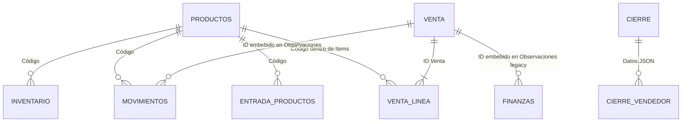

# Diccionario de datos de las hojas legacy

FASE 3C confirmó este inventario mediante el profiler reproducible, sin
modificar el XLSX ni escribir en PostgreSQL. La evidencia completa permanece
en `reports/private/profiling/` y el resultado sanitizado está en
[`phase-3c-completion-report.md`](../reviews/phase-3c-completion-report.md).
El diccionario conserva las observaciones históricas; el perfil machine-readable
es la entrada verificable para FASE 4.

## Criterios de perfilado

- “Filas” excluye el encabezado y filas completamente vacías.
- Un valor vacío es `null`, cadena vacía o celda sin valor.
- Las fechas se almacenan como seriales Excel. Los rangos se expresan según el calendario visible esperado del legacy; no se convirtieron a UTC.
- “Clave candidata” describe el snapshot actual, no una garantía de negocio.
- Los rangos físicos con formato residual no se consideran datos.

## Resumen

| Hoja | Encabezado | Rango lógico | Filas | Fórmulas | Clave pretendida/candidata |
|---|---:|---|---:|---:|---|
| Productos | 1 | `A1:G146` | 145 | 0 | Código, violada por 1 duplicado |
| Finanzas | 1 | `A1:G7` | 6 | 0 | ID_Movimiento |
| CierresDiarios | 1 | `A1:L5` | 4 | 0 | ID_Cierre; Fecha también única en snapshot |
| Movimientos | 1 | `A1:I1070` | 1,069 | 0 | No existe ID; código + timestamp + ubicación es único en snapshot |
| Entrada de Productos | 14 | `A14:G66` | 52 | 0 | Código en snapshot |
| Inventario | 1 | `A1:H360` | 359 | 1 | Producto + ubicación, violada dos veces |
| Ventas | 1 | `A1:Q405` | 404 | 0 | ID agrupa venta; no hay ID de línea |
| Unidades | 1 | `A1:A15` | 14 | 0 | Valor de unidad |
| Grupos | 1 | `A1:A12` | 11 | 0 | Valor de grupo |

## Productos

Rango de fechas: 8 de noviembre de 2025 a 4 de julio de 2026.

| Col. | Encabezado | Tipo | No vacíos | Vacíos | Únicos | Rango/anomalía |
|---|---|---|---:|---:|---:|---|
| A | Código | texto | 145 | 0 | 144 | `DGGR-X` aparece en filas 29 y 30 |
| B | Nombre | texto | 145 | 0 | 98 | Variantes/tallas comparten nombre |
| C | Unidad | texto | 145 | 0 | 3 | `Unidad` no existe como dato del catálogo Unidades |
| D | Grupo | texto | 145 | 0 | 3 | Todos los valores existen en Grupos |
| E | Stock Mínimo | número | 145 | 0 | 2 | mínimo 2, máximo 5 |
| F | Precio | número | 145 | 0 | 19 | mínimo 60, máximo 740 |
| G | Fecha Creación | fecha/hora Excel | 145 | 0 | 145 | valores únicos |

Referencias:

- Todos los códigos de Inventario, Movimientos, Entrada y artículos parseados de Ventas existen en Productos.
- `CCWL-L` existe en Productos y Movimientos, pero no en Inventario.

## Finanzas

Rango de fechas: 21 a 29 de julio de 2026.

| Col. | Encabezado | Tipo | No vacíos | Vacíos | Únicos | Rango/anomalía |
|---|---|---|---:|---:|---:|---|
| A | ID_Movimiento | texto | 6 | 0 | 6 | Clave candidata |
| B | Fecha | fecha Excel | 6 | 0 | 3 | — |
| C | Tipo | texto | 6 | 0 | 2 | 3 Ingreso, 3 Gasto |
| D | Categoría | texto | 6 | 0 | 4 | 3 filas `Ventas de Sistema` |
| E | Monto | número | 6 | 0 | 5 | 350 a 7,450 |
| F | Responsable | texto | 6 | 0 | 3 | Catálogo implícito |
| G | Observaciones | texto | 3 | 3 | 3 | Las tres observaciones contienen referencia de venta |

Totales crudos:

- ingresos: 1,400;
- gastos: 10,300.

Las tres referencias de venta existen. En una venta multi-línea, el ingreso automático equivale a la suma de dos líneas y no al total de una línea individual.

## CierresDiarios

Rango de fechas: 25 a 29 de julio de 2026.

| Col. | Encabezado | Tipo | No vacíos | Vacíos | Únicos | Rango/anomalía |
|---|---|---|---:|---:|---:|---|
| A | ID_Cierre | texto | 4 | 0 | 4 | Clave candidata |
| B | Fecha del Cierre | fecha Excel | 4 | 0 | 4 | Una fila por fecha en snapshot |
| C | Datos JSON | texto JSON | 4 | 0 | 4 | Los cuatro JSON son válidos |
| D | Total Ventas Sistema | número | 4 | 0 | 4 | 670 a 2,810 |
| E | Total Gastos Sistema | número | 4 | 0 | 1 | Todas las filas = 0 |
| F | Total Efectivo Real | número | 4 | 0 | 4 | 60 a 1,260 |
| G | Total Digital Real | número | 4 | 0 | 3 | 320 a 2,750 |
| H | Diferencia | número | 4 | 0 | 1 | Todas las filas = 0 |
| I | Estado | texto | 4 | 0 | 1 | Todas `Cuadrado` |
| J | Encargado | texto | 4 | 0 | 1 | Catálogo implícito |
| K | Timestamp | fecha/hora Excel | 4 | 0 | 4 | — |
| L | Observaciones | texto | 0 | 4 | 0 | Columna completamente vacía |

Controles:

- cada JSON contiene entre uno y cuatro vendedores;
- las sumas JSON de ventas, efectivo y digital coinciden exactamente con D, F y G;
- suma de ventas de los cuatro cierres: 6,150;
- gastos acumulados en cierres: 0.

## Movimientos

Rango de fechas: 8 de noviembre de 2025 a 29 de julio de 2026.

| Col. | Encabezado | Tipo | No vacíos | Vacíos | Únicos | Rango/anomalía |
|---|---|---|---:|---:|---:|---|
| A | Código | texto | 1,069 | 0 | 144 | Todos existen en Productos |
| B | Fecha | fecha/hora Excel | 1,069 | 0 | 261 | Se usa mediodía en algunas escrituras |
| C | Tipo | texto | 1,069 | 0 | 4 | INGRESO, VENTA, AJUSTE, TRANSFERENCIA |
| D | Cantidad | número | 1,069 | 0 | 16 | -13 a 27 |
| E | Usuario | texto | 1,069 | 0 | 3 | Email/sistema/auditoría |
| F | Timestamp | fecha/hora Excel | 1,069 | 0 | 780 | 289 repeticiones |
| G | Observaciones | texto | 1,069 | 0 | 434 | IDs de venta embebidos |
| H | Stock Resultante | número | 1,069 | 0 | 29 | 0 a 31; saldo global por código |
| I | Ubicación | texto | 1,069 | 0 | 8 | 3 almacenes + 5 rutas con flecha |

Distribución:

| Tipo | Filas | Suma de cantidad | Signo observado |
|---|---:|---:|---|
| INGRESO | 505 | 931 | 505 positivas |
| VENTA | 446 | 512 | 446 positivas; el tipo implica resta |
| AJUSTE | 93 | -60 | 68 negativas, 25 positivas |
| TRANSFERENCIA | 25 | 38 | 25 positivas |

Claves:

- no existe ID de movimiento;
- código + timestamp no es único: 862 combinaciones para 1,069 filas;
- código + timestamp + ubicación es único en este snapshot, pero no está garantizado por el código;
- la fila legacy debe conservarse como identidad de importación.

## Entrada de Productos

La tabla comienza en la fila 14. Las filas 1–13 están vacías.

Rango de fechas: 9 de noviembre de 2025 a 13 de marzo de 2026.

| Col. | Encabezado | Tipo | No vacíos | Vacíos | Únicos | Rango/anomalía |
|---|---|---|---:|---:|---:|---|
| A | codigo unico del producto | texto | 52 | 0 | 52 | Clave candidata del snapshot |
| B | nombre del producto | texto | 52 | 0 | 29 | — |
| C | cantidad de entrada del producto | número | 52 | 0 | 17 | 1 a 31; suma 387 |
| D | Descripción del Producto | texto | 45 | 7 | 45 | 7 vacíos |
| E | costo | número | 52 | 0 | 13 | 0 a 290; 4 costos cero |
| F | precio | número | 52 | 0 | 9 | 60 a 550 |
| G | fecha y hora | fecha/hora Excel | 52 | 0 | 52 | — |

La hoja se comporta como acumulado por código, no como documentos históricos de recepción.

## Inventario

Rango de fechas no vacías: 8 de noviembre de 2025 a 29 de julio de 2026.

| Col. | Encabezado | Tipo | No vacíos | Vacíos | Únicos | Rango/anomalía |
|---|---|---|---:|---:|---:|---|
| A | codigo unico del producto | texto | 359 | 0 | 143 | — |
| B | nombre del producto | texto | 359 | 0 | 67 | — |
| C | cantidad de entrada del producto | número | 359 | 0 | 8 | 0 a 19; 144 saldos cero |
| D | Descripción del Producto | texto/fórmula | 359 | 0 | 147 | Solo D2 conserva fórmula `=B2 & " " & A2` |
| E | costo | número | 359 | 0 | 39 | 0 a 468.91; una fila costo cero |
| F | precio | número | 359 | 0 | 19 | 60 a 740 |
| G | ubicacion del producto | texto | 359 | 0 | 3 | Casa Dylan, Casa Jean, Casa Luden |
| H | fecha y hora | fecha/hora Excel | 357 | 2 | 324 | vacíos en filas 153 y 154 |

Saldos:

| Almacén | Stock |
|---|---:|
| Casa Dylan | 135 |
| Casa Jean | 92 |
| Casa Luden | 139 |
| **Total** | **366** |

Claves y variaciones:

- 357 combinaciones únicas producto + ubicación para 359 filas;
- `CCWH-L` aparece duplicado en Casa Dylan y Casa Luden;
- las filas duplicadas difieren en cantidad, costo, precio y fecha;
- 19 códigos tienen más de un costo entre ubicaciones/filas;
- 9 códigos tienen más de un precio en Inventario;
- 76 filas tienen precio distinto al precio vigente de Productos.

## Ventas

Rango de fechas: 8 de noviembre de 2025 a 29 de julio de 2026.

| Col. | Encabezado | Tipo | No vacíos | Vacíos | Únicos | Rango/anomalía |
|---|---|---|---:|---:|---:|---|
| A | ID Venta | texto | 404 | 0 | 288 | Agrupa encabezado/líneas |
| B | Fecha | fecha Excel | 404 | 0 | 112 | — |
| C | Hora Salida | fracción de día | 404 | 0 | 240 | 0 a 0.98125 |
| D | Hora Finalización | fracción de día | 245 | 159 | 139 | vacío no equivale necesariamente a tránsito |
| E | Vendedor | texto | 404 | 0 | 4 | Catálogo implícito |
| F | Entregador | texto | 401 | 3 | 7 | Variantes ortográficas |
| G | Items Vendidos | texto | 404 | 0 | 147 | 449 tokens válidos `CODIGO:CANTIDAD` |
| H | Monto Cobrado | número | 404 | 0 | 52 | 60 a 3,620 |
| I | Envío Cobrado | número | 404 | 0 | 23 | 0 a 190 |
| J | Total | número | 404 | 0 | 74 | 60 a 3,620 |
| K | Lugar Extracción | texto | 404 | 0 | 3 | almacén por línea |
| L | Lugar Entrega | texto | 404 | 0 | 160 | dato potencialmente sensible |
| M | Observaciones | texto | 58 | 346 | 21 | 32 incluyen etiqueta de pago |
| N | Timestamp | fecha/hora Excel | 322 | 82 | 206 | esquema agregado tardíamente |
| O | Canal Venta | texto | 287 | 117 | 5 | incluye variante `Facebook` |
| P | Precio Unitario | número | 278 | 126 | 30 | 60 a 800 |
| Q | Columna 1 | texto | 3 | 401 | 1 | tres `Completado`; código espera `Estado de Pago` |

Controles:

- 61 IDs tienen más de una fila;
- 227 ventas tienen una fila y 61 tienen entre 2 y 10;
- 4 pares de filas son duplicados exactos;
- ID + item + almacén produce 400 combinaciones, no 404;
- las 404 filas cumplen `Monto Cobrado + Envío Cobrado = Total`;
- los 449 tokens de artículos se parsean correctamente, con cantidad positiva entera y código existente;
- suma cruda de líneas: monto 172,854.99, envío 6,808.03, total 179,663.02;
- los totales incluyen cuatro duplicados no resueltos y no son cifra aprobada para migración.

Evolución de esquema:

- 82 filas sin timestamp;
- 117 sin canal;
- 126 sin precio unitario;
- 401 sin estado explícito;
- encabezado actual Q no coincide con el nombre esperado por el código.

## Unidades

| Campo | Tipo | Filas | Vacíos | Únicos | Observación |
|---|---|---:|---:|---:|---|
| Unidad | texto | 14 | 0 | 14 | `Unidades` existe; `Unidad` no aparece como dato |

El valor `Unidad` usado por 93 productos coincide con el encabezado del catálogo, no con una opción.

## Grupos

| Campo | Tipo | Filas | Vacíos | Únicos | Observación |
|---|---|---:|---:|---:|
| Grupo | texto | 11 | 0 | 11 | Todos los grupos usados por Productos existen |

## Relaciones observadas

Estas son relaciones lógicas; Google Sheets no impone foreign keys.
