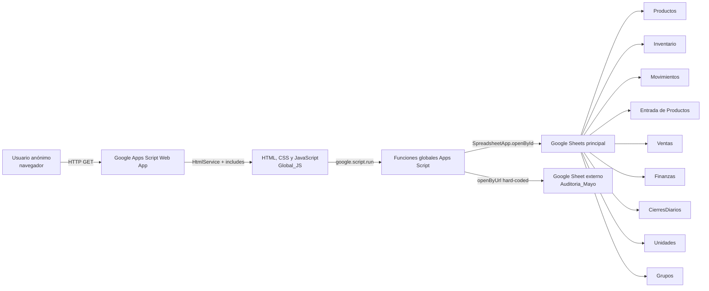

# SGI La Comarca — panorama del sistema legacy

## Propósito y alcance

Este documento describe el comportamiento observado del sistema SGI La Comarca antes de su migración. La auditoría es exclusivamente descriptiva: no corrige datos, no redefine reglas y no implementa la aplicación nueva.

Fuentes inspeccionadas:

- `AGENTS.md`;
- `docs/migration/runbook.md`;
- los 22 componentes contenidos en `legacy/private/sgi-comarca-appsscript.json`;
- las nueve hojas de `legacy/private/datos-inventario.xlsx`.

No estaban disponibles durante la auditoría `docs/project-brief.md`, `docs/architecture/` ni documentos previos en `docs/legacy/`.

## Convenciones de evidencia

| Estado | Significado |
|---|---|
| `CONFIRMED` | El comportamiento aparece explícitamente en código o datos y fue cruzado con otra evidencia cuando era posible. |
| `INFERRED` | Es la interpretación más consistente, pero no existe una regla explícita suficiente. |
| `AMBIGUOUS` | Existen implementaciones, esquemas o datos contradictorios. Requiere decisión humana. |
| `REQUIRES_HUMAN_APPROVAL` | No debe convertirse en regla de la aplicación nueva sin aprobación documentada. |

## Arquitectura actual

Características confirmadas:

- El despliegue ejecuta como el usuario propietario y permite `ANYONE_ANONYMOUS`.
- `doGet` compone una página única mediante `HtmlService`.
- La interfaz contiene nueve pestañas y tres modales; el código conserva dos variantes de dashboard, pero solo la vigente tiene invocador estático observado.
- La comunicación frontend–backend usa 38 invocaciones observadas de `google.script.run` a 29 funciones públicas distintas.
- Existen 73 declaraciones de funciones de servidor y 69 nombres únicos; cuatro se duplican exactamente en `System_Admin` y `Utils`.
- Las hojas son simultáneamente almacenamiento operacional, catálogo, historial y fuente de reportes.
- No hay capa de autenticación, autorización, dominio o transacciones.

## Superficie funcional visible

| Pantalla o modal | Funciones principales | Estado |
|---|---|---|
| Dashboard General | KPIs, alertas de stock, ventas en tránsito, confirmación y cancelación | `CONFIRMED` |
| Entrada de Productos | Alta implícita de producto, entrada, costo, precio, almacén e importación CSV | `CONFIRMED` |
| Movimientos | Transferencia, venta, ajuste y feed paginado de movimientos | `CONFIRMED` |
| Inventario | Saldos por almacén, búsqueda, alertas y exportación CSV | `CONFIRMED` |
| Buscar Producto | Búsqueda por código, nombre o grupo y detalle por ubicación | `CONFIRMED` |
| Reportes | Filtros, historial, resumen, CSV e impresión del navegador | `CONFIRMED` |
| Configuración | Validación de integridad, inicialización de hojas y limpieza de formularios | `CONFIRMED` |
| Finanzas | Ingresos/gastos, historial combinado con ventas, KPIs y cierre diario | `CONFIRMED` |
| Dashboard Analítico | Ventas, canales, vendedores, productos, tiempo, finanzas e inventario real | `CONFIRMED` |
| Modal Venta | Carrito multi-item y multi-almacén, envío, canal, pago y estado | `CONFIRMED` |
| Modal Transferencia | Producto, cantidad, origen, destino, fecha y observaciones | `CONFIRMED` |
| Modal Finanzas | Fecha, tipo, categoría, monto, responsable y observaciones | `CONFIRMED` |
| Auditoría externa | Aplica conteos de `Auditoria_Mayo` a tres almacenes y genera ajustes | `CONFIRMED`, no enlazada a la UI |

## Modelo operacional observado

### Productos

La interfaz no ofrece un mantenimiento independiente completo de productos. Un producto nuevo se crea de forma implícita al registrar una entrada. No existe flujo confirmado de edición general, desactivación ni borrado seguro de producto.

### Inventario

`Inventario` mantiene la cantidad operacional actual por producto y ubicación. El código de mutación busca la primera fila que coincide con producto + ubicación; por tanto, las combinaciones duplicadas son funcionalmente peligrosas.

`Movimientos` registra el historial, pero `calcularStock` suma por producto sin distinguir almacén. El campo `Stock Resultante` es global para el producto, aunque cada movimiento también lleva una ubicación. No es un saldo fiable por almacén.

La pestaña denominada Inventario no lee sus cantidades de la hoja Inventario: `obtenerStockPorUbicacion` reconstruye saldos desde Movimientos y solo usa Inventario para descubrir nombres de ubicaciones. En el snapshot, esa vista deriva 359 unidades, mientras la hoja Inventario contiene 366. El dashboard “Inventario Real” sí usa la hoja Inventario.

### Ventas

La implementación vigente escribe una fila por artículo, comparte el mismo ID de venta y prorratea el envío entre líneas. Versiones anteriores guardaban varios artículos en una sola celda y tenían menos columnas.

El inventario se descuenta al crear tanto una venta completada como una venta en tránsito. Confirmar el pago solo cambia el estado. Cancelar una venta en tránsito devuelve el stock por línea y marca cada línea como cancelada.

### Finanzas

Los movimientos manuales se guardan en `Finanzas`. Las ventas completadas se incorporan dinámicamente al historial financiero desde `Ventas`.

Existe además un mecanismo de limpieza, activado al leer el historial, que elimina filas con categoría `Ventas de Sistema`. Los datos inspeccionados todavía contienen tres filas de ese tipo.

### Cierres diarios

El resumen agrupa las líneas por ID de venta, suma los totales por vendedor e infiere el método de pago desde la etiqueta textual `[Pago: ...]` almacenada en observaciones. Si no existe esa etiqueta, clasifica la venta como digital.

Antes de guardar un cierre, el código intenta cancelar automáticamente todas las ventas en tránsito de esa fecha.

### Auditoría e importación

La auditoría usa URLs, nombres de almacén y una hoja externa escritos directamente en código. La importación CSV usa un bloqueo global, pero una ejecución repetida vuelve a sumar existencias y movimientos.

## Consistencia y atomicidad

Ninguna de estas operaciones es una transacción atómica:

- entrada: puede modificar Productos, Entrada, Inventario y Movimientos de forma parcial;
- ajuste: registra primero el movimiento y después actualiza Inventario;
- transferencia: descuenta origen, suma destino y registra movimiento en pasos separados;
- venta: escribe Ventas antes de descontar todos los artículos y registrar movimientos;
- cancelación: restaura una línea a la vez;
- cierre: cancela ventas y luego agrega el cierre;
- importación: escribe lotes en varias hojas sin rollback conjunto.

Solo `importarInventarioMasivo` usa `LockService`. Las demás mutaciones son vulnerables a concurrencia, reintentos y doble envío.

## Seguridad observada

- Acceso anónimo confirmado.
- Sin roles ni permisos.
- `XFrameOptionsMode.ALLOWALL`.
- Identificador del spreadsheet y URLs externas escritos en código.
- 123 asignaciones a `innerHTML` y ninguna función de escape identificada.
- Datos de venta completos se escriben en la consola del navegador.
- Funciones administrativas globales pueden borrar o reescribir contenido.
- No existe registro de auditoría general para mutaciones.

## Límites de esta especificación

- No se ejecutaron funciones Apps Script contra las hojas reales.
- No se alteró ningún archivo privado.
- Los números monetarios se preservan en su unidad original; el símbolo usado en la UI no se interpreta como una decisión de moneda.
- Las fechas de Excel son seriales sin zona horaria. Se describen como fechas locales legacy y no se convierten en esta fase.
- Las inconsistencias se reportan; no se propone todavía una corrección.
