# Flujos de usuario y procesos legacy

Los diagramas describen el orden real observado. Los nodos de “estado parcial” indican que no existe transacción.

## 1. Arquitectura actual

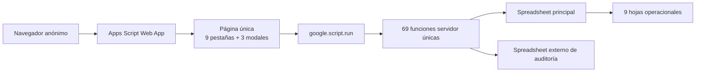

## 2. Entrada de productos

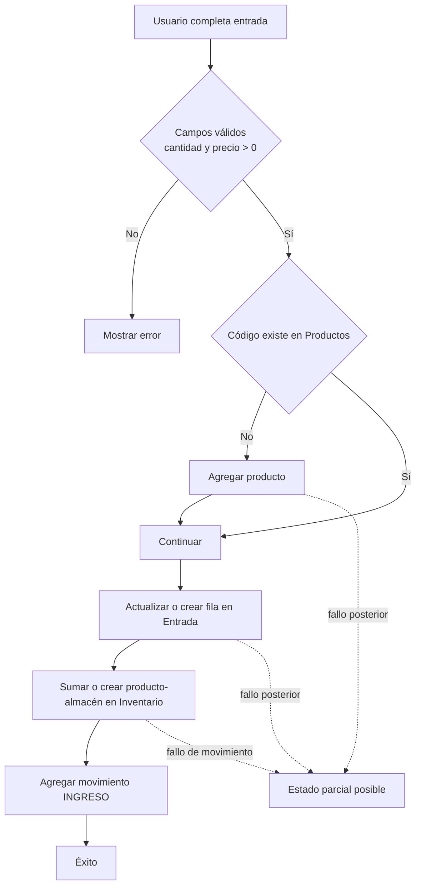

## 3. Ajuste de inventario

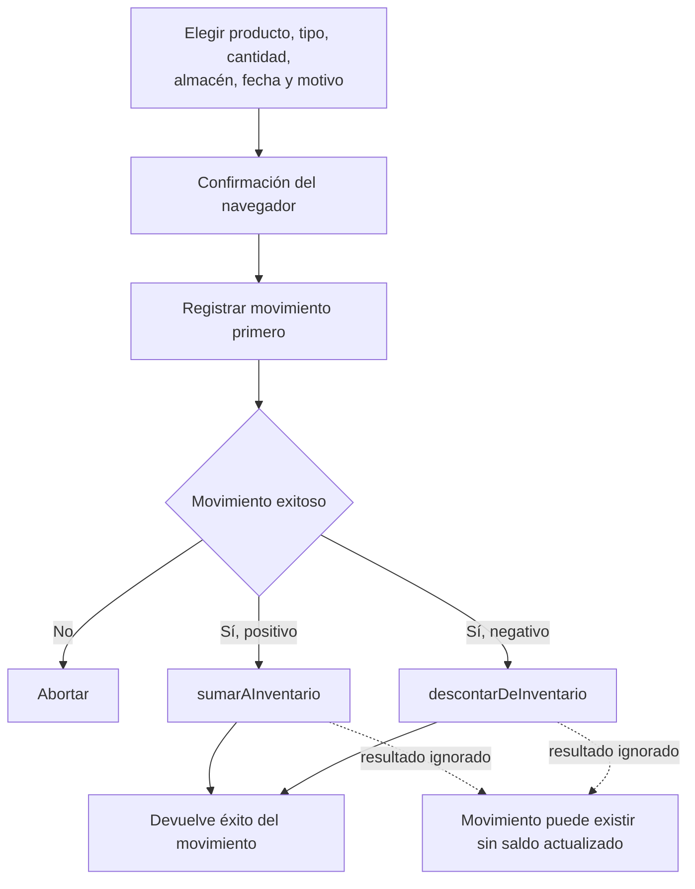

## 4. Transferencia

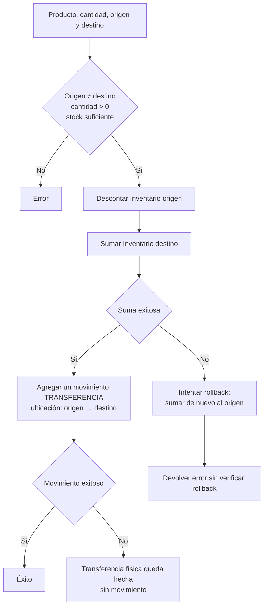

## 5. Venta completada

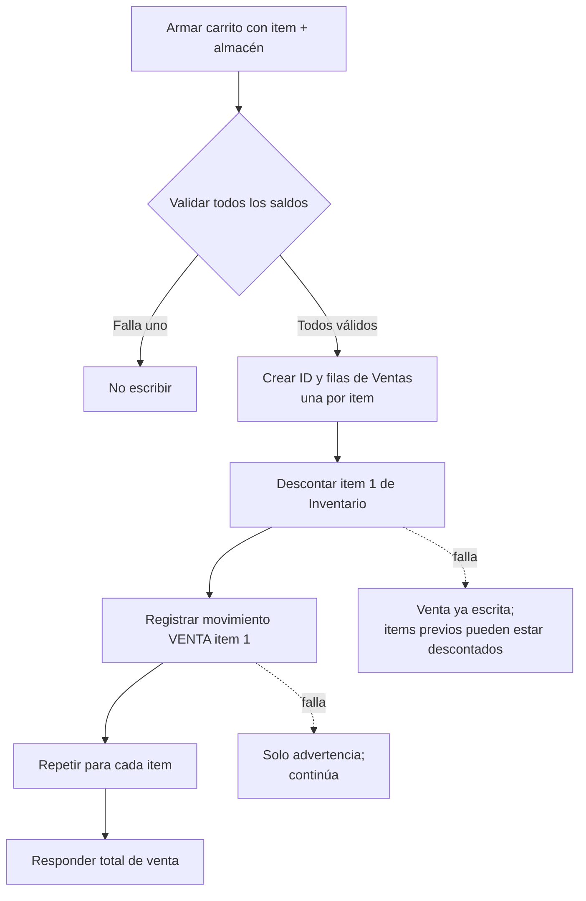

## 6. Venta en tránsito

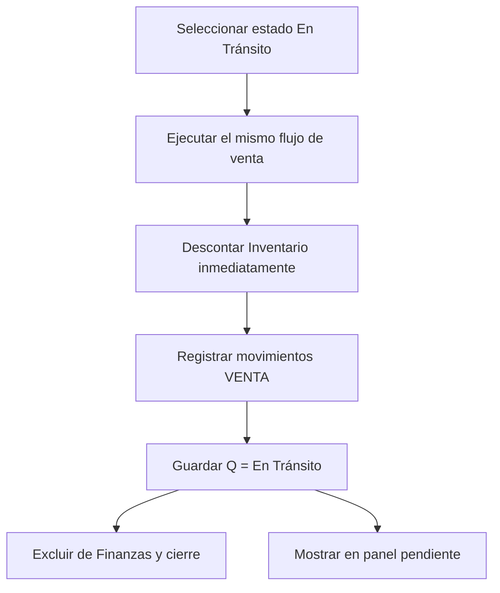

## 7. Confirmación de pago

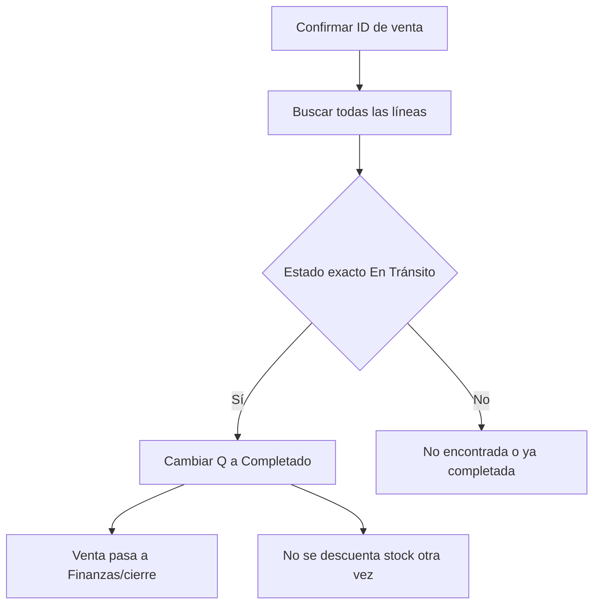

## 8. Cancelación

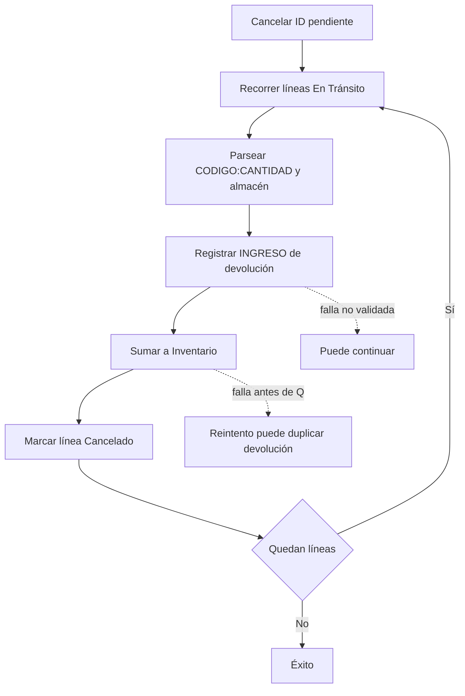

## 9. Finanzas

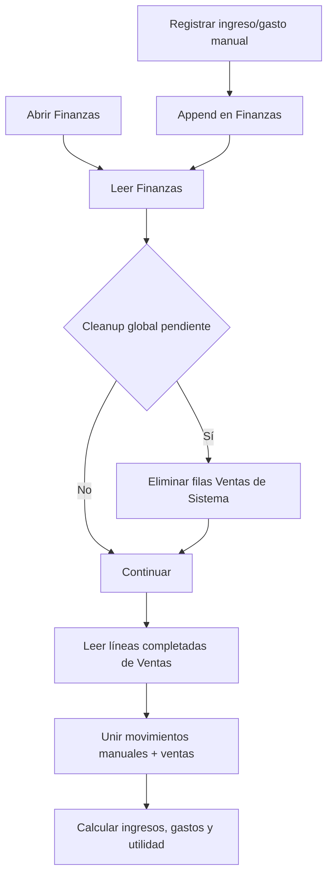

## 10. Cierre diario

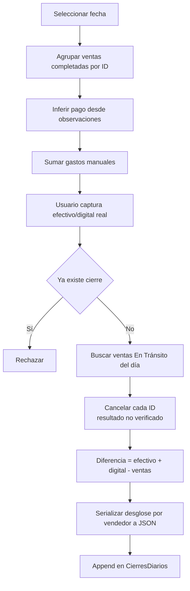

## 11. Auditoría física

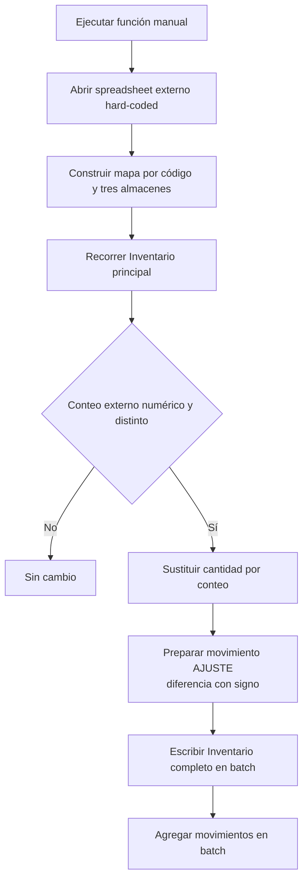

## 12. Reportes

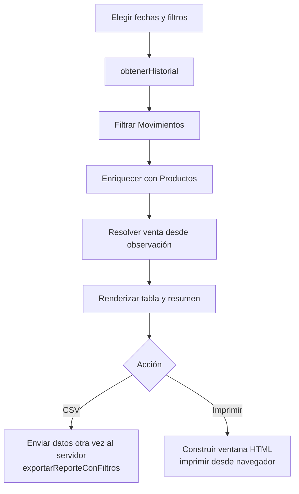

## 13. Impresión de cierre diario

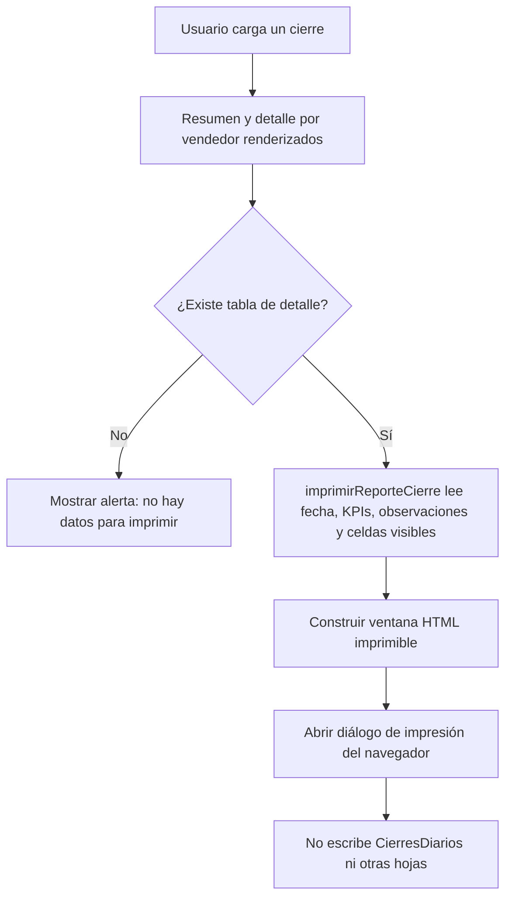

La impresión toma datos del DOM ya renderizado; no vuelve a consultar el servidor y no es una operación de cierre. El contenido depende de que la vista incluya fecha, encargado, totales, diferencia, estado, observaciones y detalle por vendedor cuando exista.

## Puntos de control que debe conservar la migración

- Una venta en tránsito ya reservó/descontó inventario.
- Confirmar no descuenta nuevamente.
- Cancelar repone exactamente las líneas originalmente descontadas.
- Venta y cierre agrupan líneas por ID.
- El almacén pertenece al artículo, no solo al encabezado.
- El envío se cobra una sola vez por venta aunque se distribuya entre líneas.
- Inventario y Movimientos son fuentes con semánticas distintas.
- Las ventas antiguas no tienen todos los campos de las nuevas.
- El cierre conserva un desglose por vendedor.
- Los reportes vinculan movimientos de venta mediante IDs embebidos en observaciones.
