# Roadmap por fases

## Principio de avance

Una fase se implementa, prueba, revisa, aprueba y confirma antes de la siguiente. Una puerta fallida detiene el avance. FASE 1 no crea código ni dependencias.

| Fase | Resultado | Dependencias/decisiones límite | Puerta principal |
|---:|---|---|---|
| 0 | Auditoría funcional y de datos | Completada; evidencia inmutable | 9 hojas, funciones y anomalías cubiertas |
| 1 | Arquitectura, brief, trazabilidad y ADR | Permisos parciales; decisiones abiertas con conducta segura | Cero funcionalidades sin destino; revisión contra FASE 0 |
| 2 | Base reproducible del monorepo | Versiones estables compatibles; sin módulos de negocio | install/lint/typecheck/test/build y health/readiness |
| 3A | Modelo estructural y migración inicial | 23 entidades exactas, Decimal, constraints, permisos y bootstrap técnico | PostgreSQL real; migración reproducible, 23 tablas de aplicación y grants exactos |
| 3B | Perfilador reproducible | Lectura XLSX sin modificación y controles legacy | Nueve hojas perfiladas; reportes privados; sin importación |
| 4 | Importador XLSX dry-run/reconciliación | Resoluciones individuales DEC-004–010; mapeos versionados | baseline reproducida, no pérdida, idempotencia |
| 5 | Auth, usuarios y permisos | Asignación SALES y permisos de transferencias; tiempos de sesión/rate limit | rutas anónimas denegadas y matriz probada |
| 6 | Catálogos e inventario | Mapeo Unidad/Unidades; permisos de transferencias; protección append-only de ProductWarehouseValuation resuelta antes de cualquier escritura operacional | concurrencia, stock no negativo, flujos atómicos; la fase no se aprueba con la protección de valoraciones pendiente |
| 7 | Ventas | Estados/pagos históricos; asignación SALES; precio/costo operativo | venta, confirmación y cancelación E2E/idempotentes |
| 8 | Finanzas y cierres | Fórmula, tolerancia, pendientes y política de reapertura detallada | no doble conteo; cierres/roles/zona probados |
| 9 | Auditoría, reportes y analytics | Dashboard/KPIs canónicos y permisos de aprobación de auditoría | KPIs contra SQL y exportaciones verificadas |
| 10 | Unificación UI | Colores/logotipo específicos si se aprueban | Playwright desktop/tablet/móvil y accesibilidad |
| 11 | Hardening | Política operativa y observabilidad | seguridad, rendimiento y carga moderada |
| 12 | Railway staging | Dominio opcional, costo real, backup/RPO/RTO pendientes | deploy, E2E, backup/restore y presupuesto |
| 13 | Rehearsal | Todas las resoluciones críticas y UAT | cero diferencias inexplicadas, importación repetible |
| 14 | Cutover | Aprobación humana, ventana, retención/rollback | smoke, reconciliación y legacy solo lectura |

## Entregas incrementales

```mermaid
flowchart LR
    A["F0 evidencia"] --> B["F1 arquitectura"]
    B --> C["F2 base"]
    C --> D["F3 esquema"]
    D --> E["F4 importador"]
    E --> F["F5 seguridad"]
    F --> G["F6 inventario"]
    G --> H["F7 ventas"]
    H --> I["F8 finanzas"]
    I --> J["F9 reportes"]
    J --> K["F10–11 UX/hardening"]
    K --> L["F12 staging"]
    L --> M["F13 rehearsal"]
    M --> N["F14 cutover"]
```

## Fechas límite de decisiones

| Decisión | Estado tras brief | Límite |
|---|---|---|
| NIO/C$ y zona | Cerrada | FASE 1 |
| Usuarios iniciales | Parcial; identidades cerradas, cuentas explícitas | FASE 5 |
| Finanzas/ajustes/cancelación/cierres | Cerradas en alcance indicado | FASE 5–8 |
| Transferencias y SALES | Abierta | antes de pruebas de permisos FASE 5/6 |
| Protección append-only de ProductWarehouseValuation | Abierta; sin trigger ni escritores operacionales en FASE 3A | entrada a FASE 6, antes de cualquier escritura de precios, costos o valoraciones |
| Duplicados/anomalías individuales | Abiertas por registro | antes de importación commit/rehearsal |
| Unidad/personas/canales/estados históricos | Abiertas | antes del commit de las entidades afectadas |
| Fórmula/tolerancia/cierre con tránsito | Abiertas | antes de FASE 8 completa |
| Dashboard canónico | Abierta | antes de FASE 9 completa |
| Colores/logotipo | Abierta y posponible | antes de aceptación visual FASE 10 |
| Dominio | Abierta y posponible | antes de producción si se requiere uno propio |
| Backup, RPO, RTO, caída | Abiertas | antes de aprobar staging/cutover |
| Retención de Sheets | Abierta | antes de finalizar estabilización |

## Puertas transversales

En cada fase:

1. Git status/diff enfocado y archivos private intactos.
2. Documentación y decisiones actualizadas.
3. Lint, typecheck, unitarias, integración y build disponibles.
4. Playwright para flujo crítico afectado.
5. Revisión de seguridad, transacciones y migraciones.
6. Sin hallazgos críticos/altos pendientes causados por la fase.

## Impacto y fecha límite de cada decisión legacy

`Sí` significa que la decisión debe resolverse antes de cerrar ese artefacto; `No*` indica que el diseño seguro puede preservar `UNKNOWN`/raw sin inventar una resolución.

| ID | Estado FASE 1 | Esquema | Importador | Pantalla/regla | Posponible | Conducta segura en staging | Fase límite |
|---|---|---:|---:|---:|---:|---|---:|
| DEC-001 | APPROVED | No | No | No | — | NIO, C$, Managua; sin conversión legacy | 1 |
| DEC-002 | PARTIAL | No | No | Sí | Sí | Crear 4 cuentas explícitas; textos legacy no son usuarios | 5 |
| DEC-003 | PARTIAL | No | No | Sí | Parcial | Denegar por defecto; permisos aprobados únicamente | 5–6 |
| DEC-004 | PARTIAL por procedimiento | Sí | Sí | Sí | No para commit | Dos filas staging; resolución individual | 4 |
| DEC-005 | PARTIAL por procedimiento | Sí | Sí | Sí | No para commit | Cuatro filas staging; no sumar/elegir | 4 |
| DEC-006 | PARTIAL por procedimiento | No | Sí | Sí | No para totales finales | Marcar candidatos; excluir solo con aprobación | 4/13 |
| DEC-007 | PARTIAL por procedimiento | No | No* | Sí | Sí hasta rehearsal | Conservar venta; no sintetizar movimiento | 13 |
| DEC-008 | PARTIAL por procedimiento | No | No* | Sí | Sí hasta rehearsal | Conservar movimiento; no sintetizar venta | 13 |
| DEC-009 | PARTIAL; fuente inicial aprobada | No | Sí | Sí | No para rehearsal | Inventario como saldo; reportar 157+4 diferencias | 4/13 |
| DEC-010 | PARTIAL | No | No* | Sí | Sí | Campo informativo raw; nunca balance por almacén | 9 |
| DEC-011 | OPEN | Sí | Sí | Sí | No para catálogo final | Preservar `Unidad`; mapeo explícito pendiente | 4/6 |
| DEC-012 | OPEN | No | No* | Sí | Sí | Texto original + candidatos, sin fusionar | 9 |
| DEC-013 | OPEN | No | No* | Sí | Sí | Canal original/UNKNOWN, sin normalizar | 9 |
| DEC-014 | APPROVED | No | No | No | — | Inventario define precio inicial; ambos valores raw | 3–4 |
| DEC-015 | PARTIALLY_RESOLVED | No* | Sí | Sí | No para import commit/analytics | `APPROVED_BY_OWNER`: Inventario define costo inicial y conserva snapshots; costos cero, variaciones, inconsistencias y margen siguen abiertos | 4/9 |
| DEC-016 | OPEN | No | No* | Sí | Sí | `LEGACY_UNKNOWN` + valor raw/inferencia separada | 7/13 |
| DEC-017 | OPEN | No | No* | Sí | Sí | Hora final nullable; no derivar estado | 7 |
| DEC-018 | OPEN | No | No* | Sí | No para cierre final | Método `UNKNOWN`; no forzar Digital | 8 |
| DEC-019 | OPEN | No | No | Sí | No para cierre final | Reportar tránsito; nunca cancelar silenciosamente | 8 |
| DEC-020 | APPROVED | No | No | No | — | SALES confirma con actor/timestamp, idempotente y sin stock | 7 |
| DEC-021 | APPROVED | No | No | No | — | Solo Dylan; motivo; total; elegible; reposición exacta | 7 |
| DEC-022 | OPEN | No | No* | Sí | No para finanzas final | Automáticos como referencia excluida del agregado | 8/13 |
| DEC-023 | OPEN | No | No | Sí | No | Guardar componentes; cálculo legacy comparativo versionado | 8 |
| DEC-024 | OPEN | No | No | Sí | No | No declarar `BALANCED` con tolerancia no aprobada | 8 |
| DEC-025 | PARTIALLY_RESOLVED | No | No | Sí | No para cierre final | `APPROVED_BY_OWNER`: Dylan/Samantha crean/reabren con motivo, actor, timestamp, historial y audit log; plazo, cierres posteriores y nueva aprobación siguen abiertos | 8 |
| DEC-026 | OPEN | No | No | Sí | Sí | CSV legacy solo validación/dry-run; XLSX es proceso nuevo | 4/6 |
| DEC-027 | OPEN | No | No* | Sí | Sí hasta FASE 9 | No ejecutar fuente externa; importar evidencia | 9 |
| DEC-028 | OPEN | No | No | Sí | No para analytics final | Comparar ambos contratos/KPIs | 9 |
| DEC-029 | OPEN | No | Sí | Sí | No para resolución | No ejecutar script; decisión por candidato | 4/13 |
| DEC-030 | OPEN | No | No* | Sí | Sí | Derivado separado y marcado; original intacto | 4 |
| DEC-031 | RESOLVED | No | No | No | — | `APPROVED_BY_OWNER`: privados/fuentes internas fuera de Git; documentos versionados sanitizados | 1 |
| DEC-032 | RESOLVED | No | No | No | — | `docs/project-brief.md` es contexto aprobado y autosuficiente de FASE 1 | 1 |

## Stop conditions

No avanzar ante pérdida de filas, stock negativo/inexplicado, duplicación financiera, ruta anónima, permiso crítico incorrecto, transacción parcial, importación no idempotente, restore no probado o costo/deploy no aprobado.
