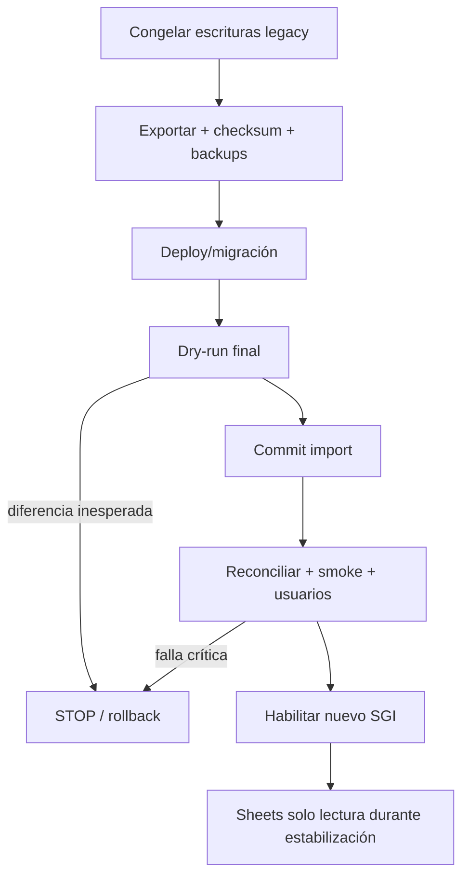

# Estrategia de rollback

## Objetivo

Permitir revertir aplicación, esquema, importación o cutover sin modificar el XLSX original ni perder evidencia. Rollback no sustituye reconciliación: una diferencia desconocida detiene el proceso.

## Niveles

| Nivel | Activador | Recuperación |
|---|---|---|
| Cambio documental/código | pruebas o review fallan | no promover; revertir el cambio enfocado mediante commit posterior aprobado |
| Despliegue web/API | health, smoke o regresión | volver al artefacto/commit anterior compatible |
| Migración de esquema | `migrate deploy` falla o rompe compatibilidad | restaurar backup o aplicar migración correctiva/down aprobada; nunca editar historial aplicado |
| Import batch | error crítico o reconciliación falla | rollback de transacción/lote y estado `ROLLED_BACK`; conservar reporte |
| Rehearsal | totales/pruebas no cuadran | restaurar staging a snapshot limpio y repetir desde checksum |
| Cutover | stop condition crítica | deshabilitar nuevo acceso, restaurar DB/versión y reabrir legacy para escritura solo mediante decisión del responsable |

## Antes de cualquier importación commit

- checksum del XLSX y copia inmutable;
- backup de PostgreSQL y prueba de restauración disponible;
- migraciones aplicadas y verificadas;
- dry-run con mismo archivo/mapeos/version;
- resoluciones humanas versionadas;
- reporte sin críticos desconocidos;
- identificador de batch y plan de eliminación/reversión probado.

## Rollback de batch

```text
begin import batch
  mark RUNNING
  write entities tagged import_batch_id
  reconcile inside/after bounded transaction
  if critical error: rollback writes; persist private failure report separately
  else mark COMMITTED
```

Si el tamaño obliga varios lotes, cada lote tiene frontera y dependencia explícitas. Un lote crítico fallido revierte sus escrituras; el estado global no se declara completo. No se eliminan filas por una consulta ni se ejecuta el importador desde una migración Prisma.

Para revertir un batch ya confirmado en staging, se usa una operación administrativa diseñada por relaciones `import_batch_id`, dentro de transacción y con reporte. No se borran movimientos operacionales posteriores; si existen, se restaura la base completa o se detiene para decisión humana.

## Esquema expand/contract

1. Cambios compatibles primero: agregar tablas/columnas nullable o defaults seguros.
2. Desplegar código que soporte estado antiguo/nuevo.
3. Backfill explícito, observable y reversible.
4. Validar.
5. Eliminar compatibilidad solo en otra versión aprobada.

Migraciones destructivas requieren backup probado, plan específico y ventana. Nunca contienen importación del XLSX ni seeds destructivos.

## Despliegue

La versión anterior debe permanecer identificada por commit/artefacto. Web y API se promueven de forma compatible con el esquema. Si falla smoke/health, se revierte aplicación sin tocar datos cuando el esquema sea backward-compatible; de lo contrario se activa el plan de restauración aprobado.

## Cutover



Stop conditions: migración fallida, pérdida de filas, stock/ventas/finanzas/cierres no reconciliados, auth fallida, operación crítica no atómica, restore no disponible o crítico no aprobado.

## Google Sheets

No se elimina ni desactiva definitivamente durante el corte. Permanece solo lectura hasta migración, reconciliación, aprobación de producción y estabilización. La duración exacta requiere aprobación. Reabrir escrituras legacy después del corte es una decisión de incidente, no automática, para evitar dos fuentes activas.

## Backup y restauración

La arquitectura exige backup programado, restauración documentada y ensayo antes del corte. Frecuencia, retención, RPO, RTO y caída máxima siguen abiertos; FASE 12 no puede aprobarse sin resolverlos y verificar que caben en el presupuesto o documentar la excepción.

## Evidencia de rollback

Cada ensayo registra versión, ambiente, checksum, backup, tiempos observados (sin convertirlos en RPO/RTO aprobados), comandos, actor, resultados, diferencias y decisión de continuar/detener. Reportes reales permanecen en rutas privadas ignoradas por Git.
